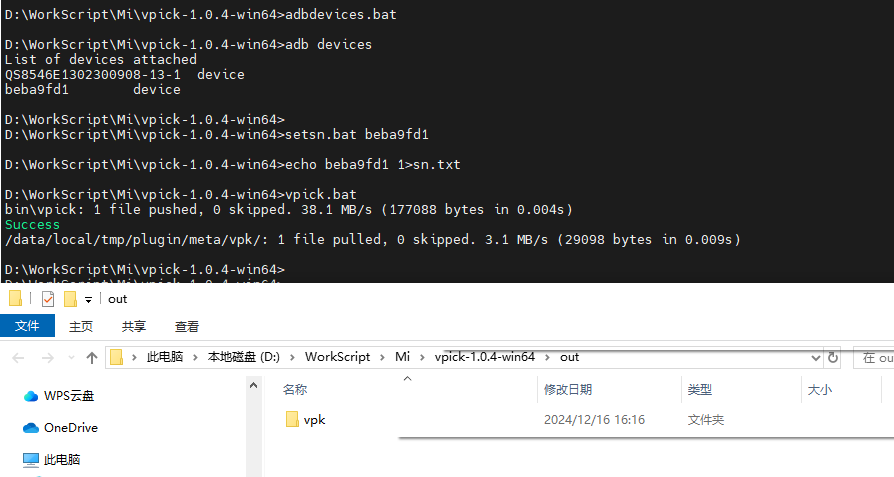
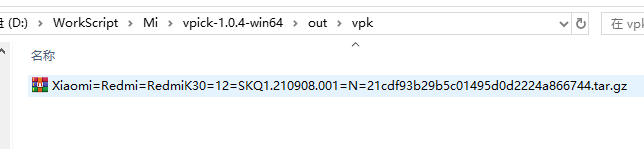

# 使用说明

vpick-win64是一个在window端运行的，用于备份真机参数的工具

1. 执行: adbdevices.bat              #查看真机的硬件序列号,如: HWXXXXX
2. 执行: setsn.bat <硬件序列号>       #设置备份目标真机, 如：setsn.bat HWXXXXX
3. 执行: vpick.bat                   #一键备份目标真机的参数,完成后将自动打开备份文件所在目录

